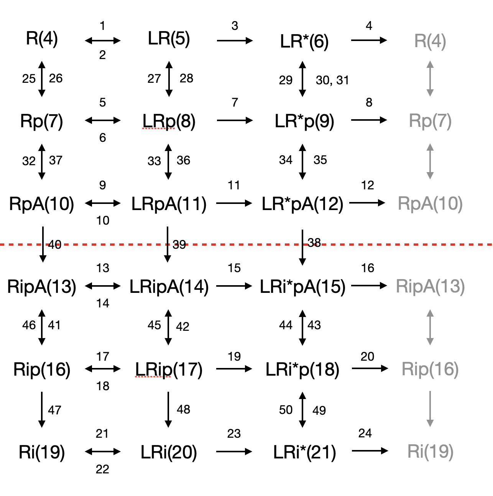

# ODE based simulation of GPCR signalling

This code accompanies the paper: **Receptor endocytosis orchestrates the spatiotemporal bias in β-arrestin signaling**.

It contains the following files:

* *code/model_vectorised.py*: running the simulations
* *model/toth_szalai_gpcr.txt*: the concentraions and reaction constants for ODE models
* *code/00-model_tutorial.ipynb*: some tutorial
* *code/01-run_models.ipynb*: code to run the simulations in the paper
* *code/02-figures.ipynb*: code to reproduce the figures of the paper

 
